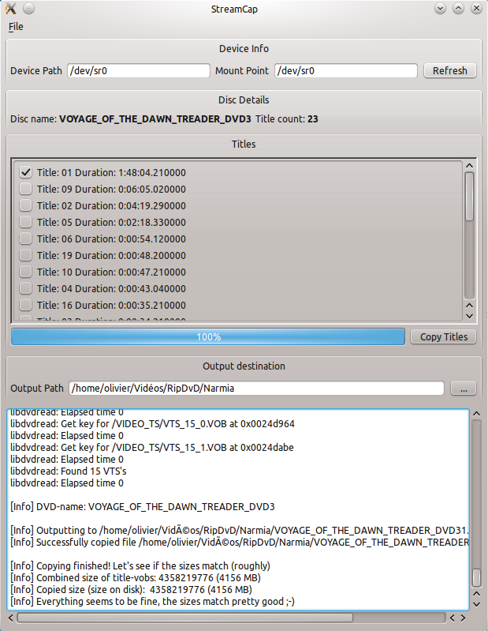

# StreamCap

O StreamCap é uma interface gráfica do usuário (GUI) em Python 3 e QT5 para Vobcopy, uma linha de comando para pegar um DVD no seu disco rígido.
Esta versão é apenas a atualização da ferramenta existente escrita em Python 2.7 e QT4 (chamada StreamCap).

Sobre
-----

Simples GUI para vobcopy, StreamCap também é simples de usar. Essa é a principal idéia para este projeto, ou seja, fácil de instalar, fácil de usar. 
Nenhuma linha de comando precisa. A primeira versão deste projeto não foi criada por mim, mas pelo razorfoss.com. 
Você pode obter o código original (a versão 0.11 no S <a href = http://sourceforge.net/projects/streamcap/> Streamcap </a>)
 
Funcionalidades
--------

* Interface agradável
* Fácil de usar
* Mantenha as preferências na memória
* Recursos essenciais do Vobcopy
* Não há linhas de comando para o Vobcopy

Screenshots
-----------



Dependências
------------

* python 2
* PyQt 4
* Qt4
* vobcopy

Instalação
------------

Por enquanto, basta abrir um console na pasta streamcap e digite:

```
python streamcap.py
```

* Manjaro

    Python3 é a versão padrão, então digite :
    ```
    python2 streamcap.py
    ```
    
* Linux Mint/Ubuntu
    
    No entanto, a versão padrão do python é a versão 2 e não a 3 até 17.10. Depois, você deve fazer o mesmo que no Manjaro. Então, digite:
    
    ```
    python streamcap.py
    ```
  
Próximas Versões
----

Aqui, o que está planejado para as próximas versões, quando eu tiver tempo para isso.

* versão 0.13 Introduzir nova versão de sinais e slot
* a versão 0.14 apresenta o python 3 por padrão
* a versão 0.15 (não necessária) apresenta a interface Qt5 e a interface do usuário
